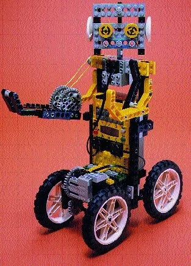

<!-- * toc
{:toc} -->

# Tracing the Modular urge
Before anything, I want to share a bit of background about this new initiative which shamefully I have no proper title for yet! I chose "ModularX" the most bland and generic name as a placeholder just to have something to refer to. hopefully no god will cast judgment on this poor taste and eventually I will come up with a holy title!

I'd like to trace back to few years ago to give a bit of background of where this Modular urge come from. I will break it down into 3 Parts: 
1. References and inspirations
2. Limbo Spaces
3. REBOOT of the past

# References and Inspirations
The following is a list of subjects that got my attention for their use of modularity within different contexts. I try to avoid the more obvious examples such as minecraft.
This list can get updated like any other posts in this blog. You can see the last revision of the post in the metadata at the end of the post.

## LEGO - ModuleX
Introduced by the LEGO Group in 1963, Modulex was designed as a planning and architectural tool rather than a toy. The system is based on a different scale than the traditional LEGO bricks, making it more suitable for detailed architectural models. The Modulex bricks are smaller, with a unique aspect ratio, and were intended to help architects, engineers, and planners visualize their projects in three dimensions.
Despite all the ambitions behind it, Modulex remained a niche product and slowly phased out from Lego's production line. 

<figure align="center">
    
    <figcaption><i>

</i></figcaption>
</figure>

<figure align="center">
    
    <figcaption><i>
Modulex - Office calendar
</i></figcaption>
</figure>

Perhaps what strike me most about Modulex's premise was that it wanted to achieve higher level and more abstract use cases. Beyond what Lego initially became known for. this new function adds a new level to the complexity of systems that Lego could facilitate. 

## LEGO - Mindstorm
Mindstorm extends Lego to a new realm of mechanism. by introducing robotic modules and a visual programming language it became not only a tool for learning robotics but also a valuable kit for quick protytyping innovative  engineering concepts. if you ever doubted my last sentence I'd recommend checking out [Brick Technology's Videos](https://www.youtube.com/@BrickTechnology/videos)

<figure align="center">
    
    <figcaption><i>
Lego Mindstorms EV3 set
</i></figcaption>
</figure>

In my opinion the most exciting aspect of Minstorms is its transparency. you can look at a Lego robot and zoom in to see how everything is put together, each parts clearly communicates its function. it's as if you are looking both at the robot and its blueprint at the same time! a kind of open mindset in system design that gives it's user an indepth and clear agency over the parts yet when you observe the behaviour of the parts as a whole you can see the higher level as clear as the low levels.
It somehow folds these different levels into a seamless one.

## Factorio
Factorio, a popular real-time strategy game focused on automation and production, stands out for its profound use of modularity within both gameplay mechanics and design philosophy. Players create intricate factories composed of modular units—conveyors, machines, and storage solutions—that can be endlessly optimized and reconfigured to improve efficiency and productivity. 
One has to play Factorio with a bit of a cautious mind, because the satisafaction that comes with it is exteremely addictive and cam make anyone a devoted capitalist!

<figure align="center">
    
    <figcaption><i>

</i></figcaption>
</figure>

Factorio manages to lure you into an obsession with scale, maintenance and optimization of a system. And there seems to be no end to it. there is always room for improvement of your factory line. Which oddly I find this kind of viscious pull into mechanics of a system very similar to coding, gamedev and similar practices.

## Nier Automata
"Nier: Automata" stands out for its innovative take on character skill customization through its Chip System, a cleverly designed modular approach that fits perfectly with the game's identity and its overaching narrative. Players can tailor their android protagonists' abilities by equipping and combining different chips, each occupying a certain amount of memory space within the character's system. This setup exposes constraints that is inherent with computation directly at the player's identity. In Nier, who you are is what you can computationally afford!

[Plug-in Chips - NIER WikiFandom](https://nier.fandom.com/wiki/Plug-in_Chips)

## Gabbeh
Gabbeh is a traditional type of Persian rug, known for its simplistic design and plush texture. Originating from the Fars province in southwest Iran, these rugs are handwoven by nomadic tribes.

What sets Gabbeh rugs apart is not just their aesthetic appeal but also their cultural significance. They are a form of storytelling, where each rug carries tales from the lives of its creators. The simplicity in their design is intentional, prioritizing emotional expression and the artisan's connection to their environment over decorative complexity.

Gabbeh uses Modular tiles as a format for expression. This modularity allows the makers to improvise and put an imprint of their observations along their travels across the landscapes of iran into these carpets. Shaping an artefact similar to a Memory slot or a form of Journaling.

## Muqarnas
It's a type of decorative architectural element found in Islamic architecture, featuring a form of ornamented vaulting. The design is built up from a series of modular components, typically including niches and small projecting brackets. These components are combined in various ways to create intricate, three-dimensional patterns that play with light and shadow.

These designs can be seen as a form of computational geometry, where repeated application of simple rules generates sophisticated structures.

### Modding Communities - PES / Asseto Corsa

---