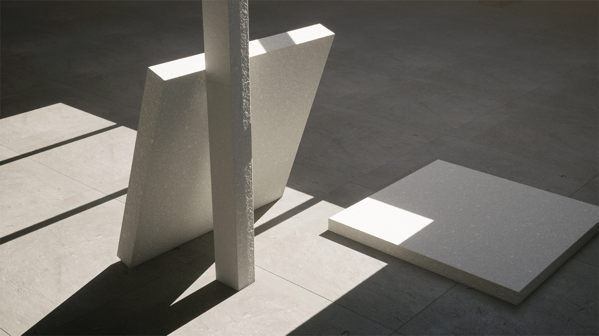
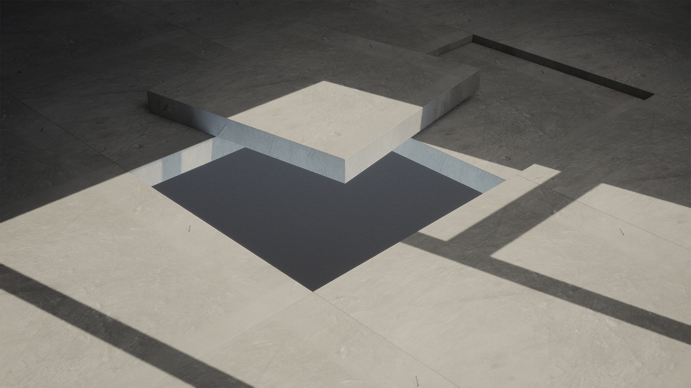

# Limbo spaces [2021-22]
As an artist and engineer working primarily with Unreal Engine, I tend to use it not only for my work as a medium to build simulations and VR experiences but also to visualize upcoming exhibitions. This helped me to get a feel of the space and use it as a soft reference to take decisions on what/how to show different elements of the work. but as time went by I realized I do this quite often and why not make it more streamlined and modular so it takes less labor each time I'll try to make a new space? So what I did was to build the most generic modules that shape the architecture of a space. the only constraint I set was each module should not be bigger than `100cm x 100cm x 100cm`.
To start all you need is a wall module, and a floor and that's it! this already takes you so far to make a space.

I took it a bit further and grabbed a photo of the grey floor of my old studio in Amsterdam, turned it into a tileable texture and basically sampled the real floor and made it into a module.

The rest of the process was basically copy pasting these modules along the floor and walls and ceiling until I get the approximate representation of the real space.

This was of course, the first attempt. a year later I moved to a bigger studio at the Rijksakademie, an attic with a very very strong presense. First thing I did after moving in was to do the same thing, only to realize after a year of working there, this space and its modular representation became a part of my film.

Obviously there was something about this modular process that hooked me up. Even though it was only a representation, the fact that the space I was working at was represented with only 3 module types (wood/grey floor/white wall) was satisfying. Even more so perhaps because of the quiteness of this representation it seemed attractive. Could call this 'Syntethic Mirror Space'!
This kind of space, can be associated to `Barzakh`, a limbo space or a phase inbetween death and resurrection.

{: .box-gray}
**Barzakh <strong>(برزخ)</strong>:**  in Islamic theology, refers to the intermediate state between death and resurrection, where souls await judgment. It's often depicted as a barrier or partition between the worldly life and the afterlife. 

## Sampling
The process of reducing recurring elements that construct the space into modules is a step that soon became integral and initial step towards this form of space making. To sample is to eventually compress and with compression comes inevetebly reduction. But reduction here is productive. It gives us clarity, simplicity and sharpness that becomes the force for creating complex spatial formations. Sampling is a treat for the mind, when used with caution and intent.

> “[there are] two kinds of things the nature of which it would be quite wonderful to grasp by means of a systematic art...
the first consists in seeing together things that are scattered about everywhere and collecting them into one kind, so that by defining each thing we can make clear the subject of any instruction we wish to give...
[the second], in turn, is **to be able to cut up each kind according to its species along its natural joints, and to try not to splinter any part, as a bad butcher might do...**
phaedrus, i myself am a lover of these divisions and collections, so that i may be able to think and to speak.”
― Plato, Phaedrus

---